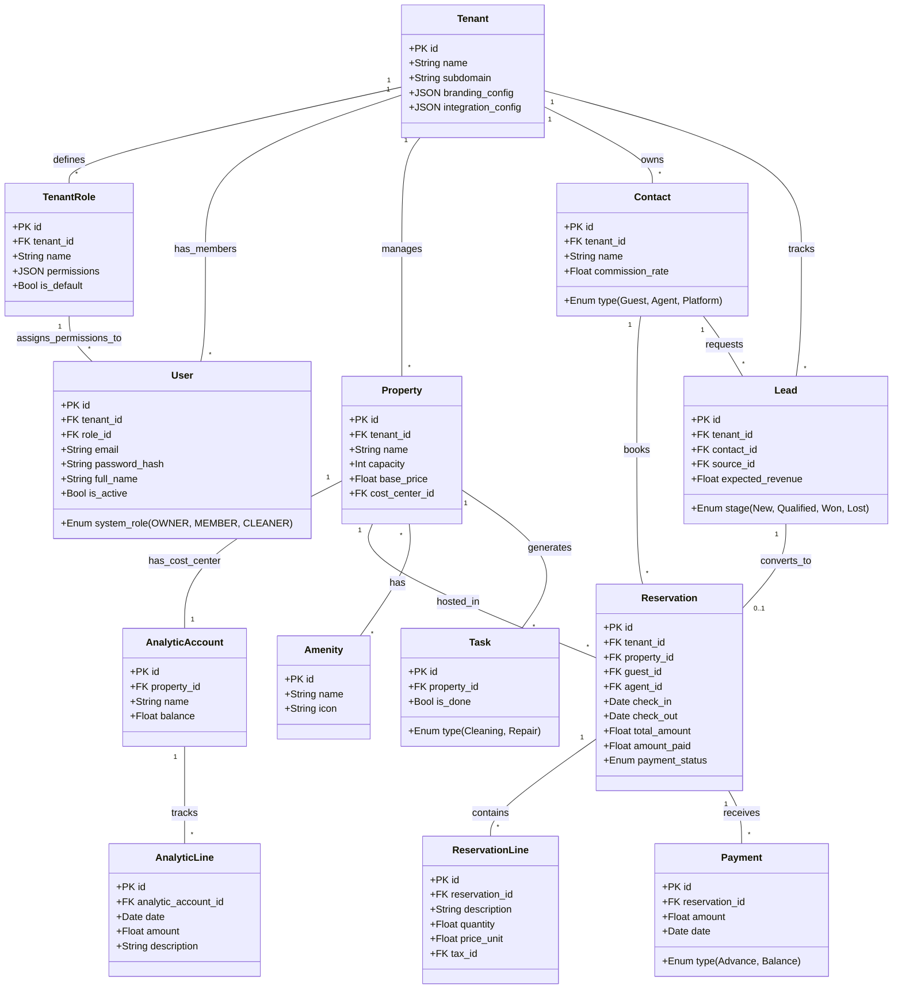
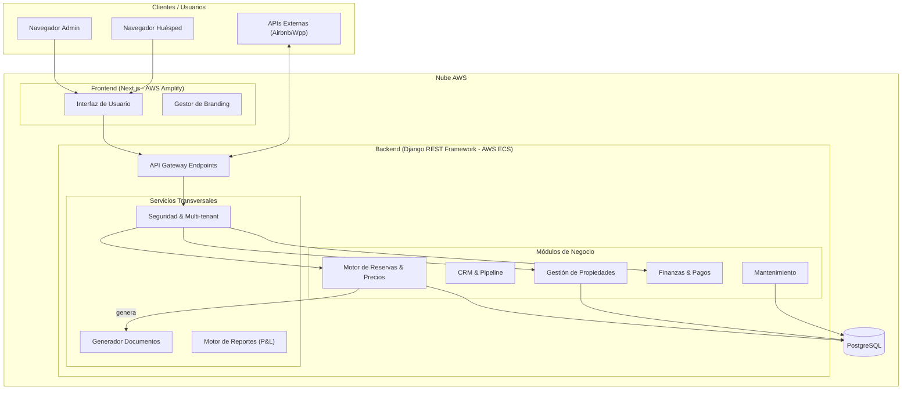

# Arquitectura del Sistema de Gestión de Propiedades y Alojamientos

## 1. Modelado del Dominio

A continuación se describen las entidades principales que componen el dominio, detallando su responsabilidad, requisitos cubiertos y nivel de complejidad.

1. A nivel macro (El Sistema Completo): Arquitectura Cliente-Servidor Desacoplada (Decoupled Architecture)
No estamos haciendo una aplicación monolítica tradicional donde el servidor (Python) escupe el HTML. El Frontend (React/Next.js) y el Backend (Django REST Framework) viven en repositorios separados, se despliegan en servicios de AWS separados (Amplify vs ECS) y solo se comunican a través de una API REST. Esta es una arquitectura Headless o API-First.

2. A nivel de dominio e infraestructura: Arquitectura multi-inquilino (SaaS Multi-tenant Architecture)
Este es el rasgo de negocio más importante.

No es un Single-tenant (una base de datos y servidor por cada inmobiliaria).
En nuestro caso, es un Multi-tenant con base de datos compartida y esquema compartido (todos los clientes usan la misma base de datos PostgreSQL, pero las filas están aisladas rígidamente por la columna tenant_id). Esto hace que el costo de infraestructura en AWS sea muy bajo al inicio y sea súper escalable.

Este tiene la posibilidad de darle acceso a otros usuarios, y crear nuevos usuarios para que estos puedan entrar y hacer uso de la plantaforma para esa empresa, EJEMPLO: "Inmobiliaria Caribe" puede crear un usuario "Carolina" con permisos de solo lectura para que ella pueda entrar a la plataforma y ver las reservas, pero no pueda editarlas ni crear nuevas. O también puede crear un usuario "Jorge" con permisos de administrador para que él pueda entrar y hacer cualquier accion.

3. A nivel de Backend (Django): Monolito Modular (Modular Monolith Architecture)
Aunque Django en su conjunto es una sola aplicación (es decir, no estamos haciendo Microservicios en Kubernetes, lo cual sería excesivo y costoso para un equipo de 4 personas), la forma internamente estructurada que definimos en el plan de desarrollo (Apps separadas: core, inventory, crm, booking, finance) la convierte en un Monolito Modular.

¿Por qué es bueno? Tienes la velocidad de desarrollo de un monolito (fácil testeo, una sola BD, despliegue simple), pero con las fronteras del código bien delimitadas. Si en 3 años el "Motor de Precios" se vuelve tan complejo que necesita su propio servidor, es muy fácil "arrancarlo" de Django y volverlo un microservicio porque ya estaba en un módulo separado.
4. A nivel de integraciones: Arquitectura Hexagonal / Puertos y Adaptadores (Ports and Adapters)
En la sección de integraciones con Airbnb, Booking y WhatsApp del documento 

architecture.md
, propusimos el uso de Adaptadores (Channel Manager Adapter).

Esto significa que el núcleo del negocio (tu motor de reservas) no "sabe" cómo habla Airbnb. Solo sabe hablar con un "Puerto genérico". Es el "Adaptador de Airbnb" el que traduce de la API de Airbnb a tu sistema.
Esto hace que el sistema sea resistente a cambios externos (si Airbnb rompe su API, tu sistema base no cae, solo falla el adaptador).

| Entidad                            | Descripción y Rol                                            | Requerimiento Cubierto                                       | Complejidad |
| :--------------------------------- | :----------------------------------------------------------- | :----------------------------------------------------------- | :---------- |
| **Tenant** (Inquilino SaaS)        | Representa a la empresa o host que usa la plataforma (e.g., "Inmobiliaria Caribe"). Aísla los datos y configuraciones. | **SaaS Multi-tenant**: Permitir múltiples clientes en una sola infraestructura con marca propia. | Alta        |
| **TenantRole** (Rol por Tenant)    | Define roles con permisos granulares por módulo dentro de un Tenant. El Admin puede crear "Solo Lectura", "Editor Reservas", etc. Cada rol tiene un JSON de permisos. | **Gestión de Accesos (US-1.1.1)**: Que cada empresa decida qué puede hacer cada usuario de su equipo. | Media       |
| **User** (Usuario)                 | Persona con credenciales de acceso al panel. Pertenece a un Tenant y tiene un TenantRole asignado que define sus capacidades. El `OWNER` (primer usuario) tiene acceso irrevocable. | **Colaboración Segura**: Que el equipo trabaje en la plataforma sin compartir contraseñas ni dar acceso irrestricto. | Media       |
| **Property** (Propiedad)           | La unidad de negocio principal. Almacena características físicas, ubicación y reglas financieras (Centro de Costos). | **Gestión de Inventario**: Administrar múltiples alojamientos y su disponibilidad. | Media       |
| **Amenity** (Comodidad)            | Características de la propiedad (WiFi, Aire Acondicionado, Piscina). | **Filtros y Detalle**: Informar al huésped qué incluye el alojamiento. | Baja        |
| **Contact** (Partner)              | Entidad unificada para Huéspedes, Agentes (Comisionistas) y Plataformas (Airbnb). | **CRM y Comisiones**: Centralizar la base de datos de clientes e intermediarios. | Media       |
| **Reservation** (Reserva)          | El contrato de alquiler. Maneja fechas, estados, cálculo de noches y totales. Es la entidad central operativa. | **Motor de Reservas**: Controlar el ciclo de vida (Borrador -> Confirmado). | Alta        |
| **ReservationLine**                | Detalle de cobro (Noches, Limpieza, IVA).                    | **Desglose Financiero**: Poder cobrar servicios adicionales e impuestos por separado. | Media       |
| **Payment** (Pago)                 | Registro transaccional de dinero recibido. Distingue entre Anticipos y Saldos Finales. | **Control de Caja**: Saber quién debe dinero y cuánto se ha recaudado. | Alta        |
| **Tax** (Impuesto)                 | Reglas impositivas configurables (IVA 19%, Turismo). Se aplican a las líneas de reserva. | **Compliance Legal**: Facturar correctamente según la ley local. | Media       |
| **Lead** (Prospecto CRM)           | Oportunidad de venta previa a la reserva. Gestiona el estado (Nuevo -> Cotizado -> Ganado). | **CRM**: Seguimiento de clientes potenciales de WhatsApp/Airbnb antes de cerrar. | Media       |
| **AnalyticAccount** (Centro Costo) | Cuenta financiera asociada a cada Propiedad para agrupar ingresos y gastos. | **Rentabilidad**: Generar estado de resultados (P&L) por apartamento. | Alta        |
| **Task** (Tarea)                   | Orden de trabajo operativa (Limpieza, Reparación). Se activa auto. al Check-out. | **Operaciones**: Gestión del personal de limpieza y mantenimiento. | Baja        |
| **Template** (Plantilla)           | Modelos de correo, mensaje o PDF configurables con variables dinámicas. | **Personalización**: Enviar correos y facturas con la marca del cliente. | Media       |

### 1.1 Diagrama de Relaciones de Entidades (ERD / Clases)

Este diagrama muestra la estructura de las tablas, sus campos clave y cómo se relacionan para formar la solución integral.

------

## 2. Descripción de los Componentes

A continuación se detallan los subsistemas técnicos que implementan la solución.

### A. Frontend: Portal Web (Spa & Dashboard)

- **Tecnología**: **Next.js (React)** + TailwindCSS.
- **Rol**: Interfaz de usuario para administradores y huéspedes.
- **Sub-componentes**:
  - *SaaS Context Provider*: Carga dinámicamente colores y logos según el subdominio.
  - *Dashboard View*: Gráficos de ocupación e ingresos.
  - *Calendar Component*: Vista drag-and-drop de reservas.
  - *Guest Portal*: Vista pública read-only para el huésped.

### B. Backend: API RESTful & Lógica de Negocio

- **Tecnología**: **Python (Django REST Framework)**.
- **Rol**: Orquestador central. Procesa reglas de negocio, validaciones y seguridad.
- **Sub-componentes**:
  - *Pricing Engine*: Calcula precios complejos basados en fechas y reglas.
  - *Tenant Middleware*: Asegura el aislamiento de datos entre clientes.
  - *Doc Generator*: Servicio (usando WeasyPrint) que renderiza PDFs desde HTML.

### C. Base de Datos Relacional

- **Tecnología**: **PostgreSQL (AWS RDS)**.
- **Rol**: Persistencia de datos transaccional segura.
- **Características**: Uso de Foreign Keys estrictas, Check Constraints para integridad de datos y particionado lógico por `tenant_id`.

### D. Capa de Integración (Channel Manager Adapter)

- **Tecnología**: Python (Módulos internos).
- **Rol**: Abstracción de APIs externas. Permite conectar nuevas plataformas sin romper el núcleo.
- **Adaptadores**:
  - `AirbnbAdapter`: Sincronización vía iCal (MVP) o API oficial.
  - `WhatsAppService`: Envío de mensajes vía API (Twilio/Meta).

------

## 3. Diagrama de Arquitectura del Sistema

Este diagrama ilustra cómo interactúan los componentes técnicos para entregar la solución SaaS.

### Justificación de la Arquitectura

- **Desacople Frontend-Backend**: Permite iterar la UI (Next.js) rápidamente sin tocar la lógica compleja (Python).
- **Backend**: Python (Django REST Framework). *Python se elige para mantener la facilidad de lógica de negocio similar a Odoo.*
- **Base de Datos**: PostgreSQL.
