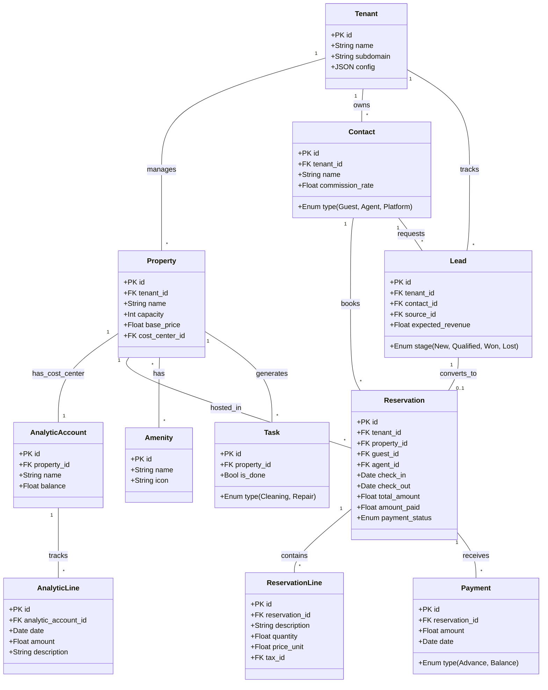
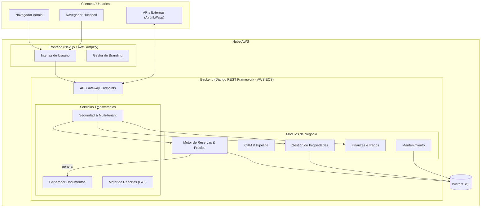

# Arquitectura del Sistema de Gestión de Propiedades y Alojamientos

## 1. Modelado del Dominio

A continuación se describen las entidades principales que componen el dominio, detallando su responsabilidad, requisitos cubiertos y nivel de complejidad.

| Entidad                            | Descripción y Rol                                            | Requerimiento Cubierto                                       | Complejidad |
| :--------------------------------- | :----------------------------------------------------------- | :----------------------------------------------------------- | :---------- |
| **Tenant** (Inquilino SaaS)        | Representa a la empresa o host que usa la plataforma (e.g., "Inmobiliaria Caribe"). Aísla los datos y configuraciones. | **SaaS Multi-tenant**: Permitir múltiples clientes en una sola infraestructura con marca propia. | Alta        |
| **Property** (Propiedad)           | La unidad de negocio principal. Almacena características físicas, ubicación y reglas financieras (Centro de Costos). | **Gestión de Inventario**: Administrar múltiples alojamientos y su disponibilidad. | Media       |
| **Amenity** (Comodidad)            | Características de la propiedad (WiFi, Aire Acondicionado, Piscina). | **Filtros y Detalle**: Informar al huésped qué incluye el alojamiento. | Baja        |
| **Contact** (Partner)              | Entidad unificada para Huéspedes, Agentes (Comisionistas) y Plataformas (Airbnb). | **CRM y Comisiones**: Centralizar la base de datos de clientes e intermediarios. | Media       |
| **Reservation** (Reserva)          | El contrato de alquiler. Maneja fechas, estados, cálculo de noches y totales. Es la entidad central operativa. | **Motor de Reservas**: Controlar el ciclo de vida (Borrador -> Confirmado). | Alta        |
| **ReservationLine**                | Detalle de cobro (Noches, Limpieza, IVA).                    | **Desglose Financiero**: Poder cobrar servicios adicionales e impuestos por separado. | Media       |
| **Payment** (Pago)                 | Registro transaccional de dinero recibido. Distingue entre Anticipos y Saldos Finales. | **Control de Caja**: Saber quién debe dinero y cuánto se ha recaudado. | Alta        |
| **Tax** (Impuesto)                 | Reglas impositivas configurables (IVA 19%, Turismo). Se aplican a las líneas de reserva. | **Compliance Legal**: Facturar correctamente según la ley local. | Media       |
| **Lead** (Prospecto CRM)           | Oportunidad de venta previa a la reserva. Gestiona el estado (Nuevo -> Cotizado -> Ganado). | **CRM**: Seguimiento de clientes potenciales de WhatsApp/Airbnb antes de cerrar. | Media       |
| **AnalyticAccount** (Centro Costo) | Cuenta financiera asociada a cada Propiedad para agrupar ingresos y gastos. | **Rentabilidad**: Generar estado de resultados (P&L) por apartamento. | Alta        |
| **Task** (Tarea)                   | Orden de trabajo operativa (Limpieza, Reparación). Se activa auto. al Check-out. | **Operaciones**: Gestión del personal de limpieza y mantenimiento. | Baja        |
| **Template** (Plantilla)           | Modelos de correo, mensaje o PDF configurables con variables dinámicas. | **Personalización**: Enviar correos y facturas con la marca del cliente. | Media       |

### 1.1 Diagrama de Relaciones de Entidades (ERD / Clases)

Este diagrama muestra la estructura de las tablas, sus campos clave y cómo se relacionan para formar la solución integral.

------

## 2. Descripción de los Componentes

A continuación se detallan los subsistemas técnicos que implementan la solución.

### A. Frontend: Portal Web (Spa & Dashboard)

- **Tecnología**: **Next.js (React)** + TailwindCSS.
- **Rol**: Interfaz de usuario para administradores y huéspedes.
- **Sub-componentes**:
  - *SaaS Context Provider*: Carga dinámicamente colores y logos según el subdominio.
  - *Dashboard View*: Gráficos de ocupación e ingresos.
  - *Calendar Component*: Vista drag-and-drop de reservas.
  - *Guest Portal*: Vista pública read-only para el huésped.

### B. Backend: API RESTful & Lógica de Negocio

- **Tecnología**: **Python (Django REST Framework)**.
- **Rol**: Orquestador central. Procesa reglas de negocio, validaciones y seguridad.
- **Sub-componentes**:
  - *Pricing Engine*: Calcula precios complejos basados en fechas y reglas.
  - *Tenant Middleware*: Asegura el aislamiento de datos entre clientes.
  - *Doc Generator*: Servicio (usando WeasyPrint) que renderiza PDFs desde HTML.

### C. Base de Datos Relacional

- **Tecnología**: **PostgreSQL (AWS RDS)**.
- **Rol**: Persistencia de datos transaccional segura.
- **Características**: Uso de Foreign Keys estrictas, Check Constraints para integridad de datos y particionado lógico por `tenant_id`.

### D. Capa de Integración (Channel Manager Adapter)

- **Tecnología**: Python (Módulos internos).
- **Rol**: Abstracción de APIs externas. Permite conectar nuevas plataformas sin romper el núcleo.
- **Adaptadores**:
  - `AirbnbAdapter`: Sincronización vía iCal (MVP) o API oficial.
  - `WhatsAppService`: Envío de mensajes vía API (Twilio/Meta).

------

## 3. Diagrama de Arquitectura del Sistema

Este diagrama ilustra cómo interactúan los componentes técnicos para entregar la solución SaaS.

### Justificación de la Arquitectura

- **Desacople Frontend-Backend**: Permite iterar la UI (Next.js) rápidamente sin tocar la lógica compleja (Python).
- **Backend**: Python (Django REST Framework). *Python se elige para mantener la facilidad de lógica de negocio similar a Odoo.*
- **Base de Datos**: PostgreSQL.