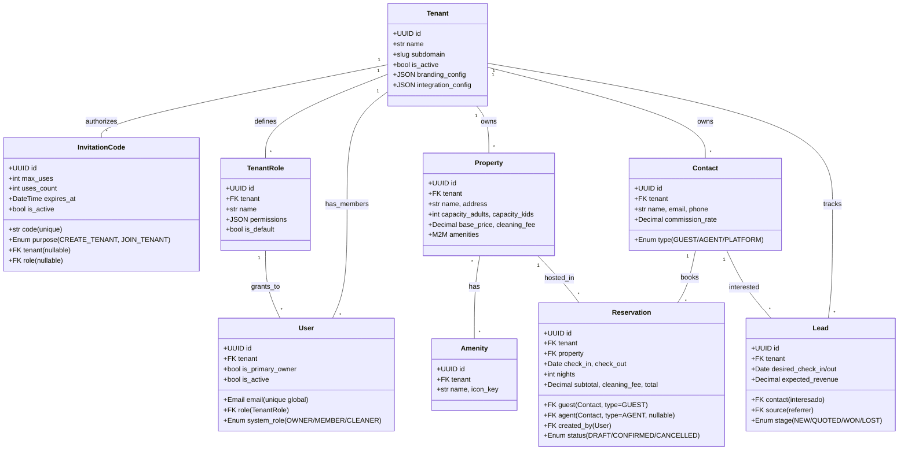

# Arquitectura

## 1. Vista alto nivel

Desacoplado, API-first, multi-tenant.

```
┌──────────────────────┐         HTTPS          ┌──────────────────────────┐
│  Next.js (Frontend)  │ ─────── REST/JSON ────▶│  Django REST (Backend)  │
│  - App Router        │                         │  - Apps modulares        │
│  - Tailwind + shadcn │                         │  - JWT auth              │
│  - localStorage JWT  │ ◀── Bearer + X-Tenant ──│  - Multi-tenant middleware│
└──────────────────────┘                         └────────────┬─────────────┘
                                                              │
                                                              ▼
                                                  ┌─────────────────────┐
                                                  │   PostgreSQL        │
                                                  │   (un schema, todas │
                                                  │   las filas filtradas│
                                                  │   por tenant_id)    │
                                                  └─────────────────────┘
```

## 2. Multi-tenancy: cómo se aísla la data

Multi-tenant **shared database, shared schema**. Cada fila lleva
`tenant_id` y los queries SIEMPRE lo filtran. Tres capas que protegen:

### 2.1 Modelo base abstracto

`apps/core/models.py:TenantAwareModel` agrega un FK obligatorio a `Tenant`
y un manager que filtra por contexto.

```python
class TenantAwareModel(TimeStampedUUIDModel):
    tenant = models.ForeignKey(Tenant, on_delete=models.CASCADE)
    objects = TenantAwareManager()       # filtra por contexto
    all_objects = models.Manager()       # escape hatch para signup/admin
    class Meta: abstract = True
```

Cualquier modelo de negocio (`Property`, `Reservation`, `Contact`, ...)
hereda de aquí.

### 2.2 Middleware + contextvars

`apps/core/middleware.py:TenantResolutionMiddleware`:

1. Lee el header `X-Tenant-ID` (UUID) del request.
2. Si no está, intenta resolverlo por subdominio del Host.
3. Valida que el tenant exista y esté **activo** (`is_active=True`). Si no
   → 404.
4. Inyecta `request.tenant` y `request.tenant_id`.
5. Setea el `tenant_id` en un `contextvars.ContextVar` thread-safe que el
   `TenantAwareManager` lee para filtrar queries.

Esto evita que el desarrollador "olvide" filtrar por tenant: cualquier
`Property.objects.all()` retorna sólo las del tenant actual.

### 2.3 Permission class

`apps/core/permissions.py:TenantModulePermission` valida en cada request:

1. El user esté autenticado.
2. El user pertenezca al tenant del path (`/api/tenants/<tenant_id>/...`).
3. El user tenga el `permission_level` requerido en el `permission_module`
   declarado por el view.

Aunque el middleware ya filtra, este check evita escribir en otro tenant
o leer endpoints que no deberías.

## 3. RBAC (Role-Based Access Control)

Cada `Tenant` tiene su propia colección de `TenantRole`s. Cada rol tiene
un JSON `permissions` con un nivel por módulo:

```json
{
  "core": "read",
  "users": "none",
  "inventory": "write",
  "crm": "read",
  "booking": "write",
  "finance": "none"
}
```

Niveles (jerarquía: NONE < READ < WRITE < ADMIN):

| Nivel  | Significado                                                              |
| ------ | ------------------------------------------------------------------------ |
| `none` | El módulo no aparece para el usuario.                                    |
| `read` | Puede listar/ver pero no modificar.                                      |
| `write`| Puede crear/editar.                                                       |
| `admin`| Puede borrar y administrar (incluye gestión de usuarios y códigos).      |

`User.system_role` adicional:

- `OWNER`: ignora `role.permissions`, tiene acceso a todo. Sólo el primer
  usuario al crear el tenant lo es. No se puede degradar ni desactivar.
- `MEMBER`: usa `role.permissions`.
- `CLEANER`: rol especial para personal de limpieza, sin acceso al
  backoffice (Sprint 4).

El primer signup-con-código de cada tenant siempre crea un OWNER.

## 4. Estructura de apps Django

```
demoairbnb/
├── manage.py
├── ruff.toml
├── apps/
│   ├── core/          # Tenants, Users, Roles, InvitationCode, middleware, permisos
│   │   ├── models.py
│   │   ├── managers.py
│   │   ├── middleware.py
│   │   ├── permissions.py
│   │   ├── tenant_context.py
│   │   ├── constants.py    # PermissionLevel, ModuleKey, SystemRole
│   │   ├── crypto.py       # Sprint 5 — Fernet encrypt/decrypt
│   │   ├── integrations.py # Sprint 4 — GoogleCalendarCredential + adapter
│   │   ├── serializers.py
│   │   ├── services.py     # create_tenant_with_owner, issue_*_code, etc.
│   │   ├── views.py
│   │   ├── urls.py
│   │   ├── admin.py
│   │   ├── management/commands/issue_invite_code.py
│   │   └── tests/
│   ├── inventory/     # Properties (con cost_center auto), Amenities
│   ├── crm/           # Contacts, Leads
│   ├── booking/       # Reservations, ReservationLines, PriceRules, quote
│   ├── finance/       # Tax, AnalyticAccount/Line, Payment, P&L, Excel
│   └── ops/           # Sprint 4 — Tasks, MessageTemplates, voucher PDF
└── demoairbnb/        # settings, urls, wsgi
```

### Por qué apps separadas

Aunque es un monolito, las apps están separadas para que el día de mañana
sea fácil "arrancar" un módulo a un microservicio. La regla:

- Nada en `apps/inventory/` puede importar de `apps/booking/`.
- Las dependencias van todas a `apps/core/` (modelos base, permisos).
- Si un módulo necesita lógica cross-app, ponla en su `services.py` y
  haz que el otro la llame por su API REST (no import directo).

### Side-effects al crear/confirmar reservas

Cuando `apps.booking.services.create_reservation()` corre, dispara una
cadena ordenada (toda dentro de `transaction.atomic`):

1. Validaciones (tenant ownership, contact types, availability).
2. `calculate_quote()` con `PriceRule`s aplicables.
3. Creación de la `Reservation`.
4. Auto-creación de `ReservationLine`s (NIGHT + FEE).
5. Si está confirmada/checked-in → `apps.finance.services.accrue_reservation_income()`
   que crea las líneas analíticas INCOME (+ COMMISSION si hay agente).
6. `apps.ops.services.ensure_cleaning_task_for_reservation()` crea la
   tarea de limpieza para el día de check-out.
7. (Futuro) `get_adapter_for_tenant().sync_reservation()` para Google Calendar.

Cada side-effect es **idempotente**: si la reserva se vuelve a procesar
(reintento, edición), no se duplican filas.

## 5. Modelo del dominio (Sprint 0/1)



Modelos pendientes (Sprint 2-4): `PriceRule`, `ReservationLine`, `Payment`,
`Tax`, `AnalyticAccount`, `AnalyticLine`, `Task`, `MessageTemplate`. Ver
`STATE.md`.

## 6. Decisiones de diseño clave

### 6.1 ¿Por qué `InvitationCode` en su propio modelo y no un campo en `Tenant`?

Antes el código vivía en `Tenant.branding_config['invitation_code']`. Era
problemático:

- No tenía control de uso (cualquiera podía reusarlo infinitamente).
- No se podía expirar.
- No diferenciaba "crear empresa nueva" de "unirse a empresa existente".
- No había auditoría (¿quién lo emitió, cuándo, para quién?).
- Lo veía cualquier usuario que pudiera leer `branding_config`.

El modelo nuevo soporta `max_uses`, `expires_at`, `consume()` atómico,
audit trail (`created_by`, `notes`), y dos propósitos distintos.

### 6.2 ¿Por qué bloquear el signup público?

La plataforma no es un SaaS self-service. La premisa de negocio es:
**el operador del SaaS conoce a sus clientes, los onboarda manualmente
y les genera un código de invitación**. Esto evita:

- Spam de tenants falsos.
- Costos de hosting por cuentas que no pagan.
- Necesidad de verificar emails / tarjetas de crédito.

Si en el futuro se quiere abrir el self-service (con pago vía Stripe,
por ejemplo), se reactiva la creación pública añadiendo un wizard que
emita el `InvitationCode` automáticamente tras pagar.

### 6.3 ¿Por qué `system_role=OWNER` ignora el `role`?

Garantiza que **siempre** haya al menos un usuario que pueda gestionar
el tenant, incluso si por error se borraron todos los roles o se les
quitaron permisos. El OWNER nunca se queda fuera. Es un fail-safe.

### 6.4 ¿Por qué `Solo Lectura` ya no incluye `users` ni `finance`?

Ver `PRIVACY_AND_RBAC.md`. Resumen: porque la lista de usuarios y los
números financieros son los datos más sensibles del tenant; un rol
"de solo lectura" por defecto no debería verlos. Quien quiera que sí
los vean, los habilita explícitamente al crear/editar el rol.

### 6.5 ¿Por qué `integration_config` se oculta a no-OWNER?

Ese JSON puede contener tokens de API (Google OAuth refresh token, etc.).
Filtrarlo en el serializer es la última línea de defensa: aunque un
endpoint accidentalmente lo retornara, sólo el OWNER vería el contenido.
